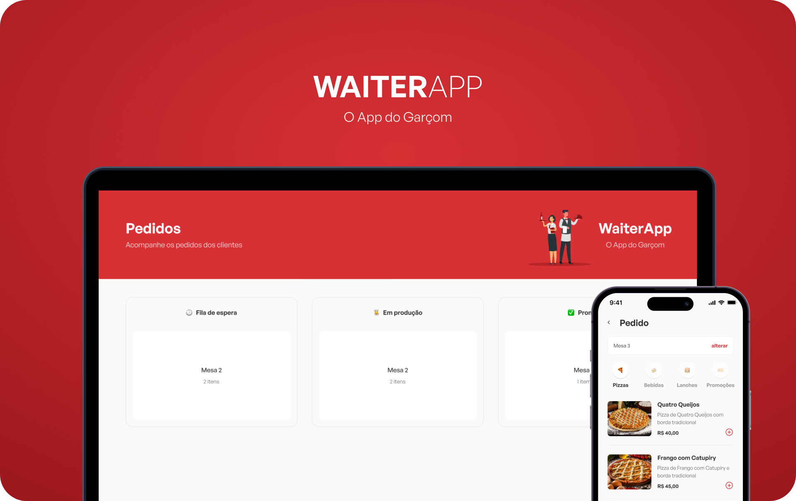
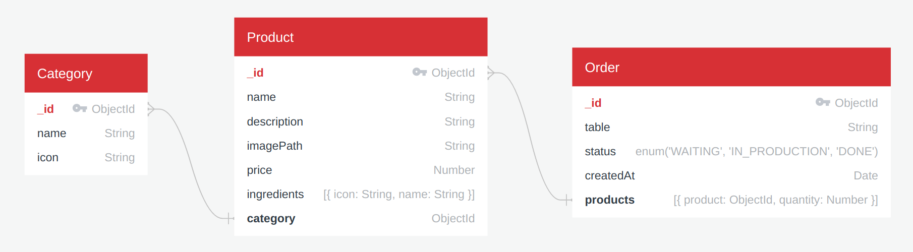
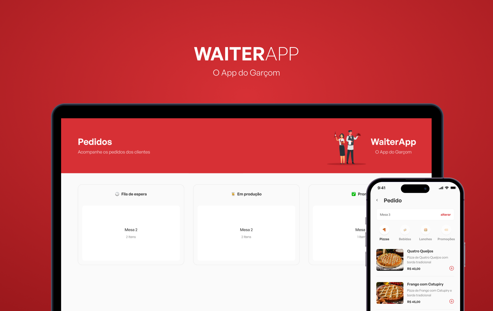

<p align="center">
  
</p>

<p align="center">
  <a href="https://www.linkedin.com/in/gabriel-bonizario/">
    
  </a>
  <a href="https://www.typescriptlang.org/">
    
  </a>
  <a href="https://nodejs.org/">
    
  </a>
  <a href="https://reactjs.org/">
    
  </a>
  <a href="https://reactnative.dev/">
    
  </a>
  <a href="https://www.mongodb.com/">
    
  </a>
  <a href="https://expo.dev/">
    
  </a>
</p>

<br />

# 👨‍🍳 Sobre

**WAITER**APP é um software de gerenciamento de pedidos para restaurantes!

Nele, garçons podem anotar pedidos pelo app e enviá-los para o dashboard web, em formato de kanban,
dividido em 3 colunas: 🕒 Fila de espera, 👨‍🍳 Em produção e ✅ Pronto!

O projeto foi desenvolvido inteiramente em Typescript.

O frontend web e mobile foram construídos usando React, React Native, Expo, Vite e Styled Components.
Já a api, usando Node.js, Express e MongoDB.

<br />

**Estrutura do banco de dados:**



<br />

# 🎨 Layout

Os layouts do app estão disponíveis no **Figma**: https://www.figma.com/file/dm7tP9X81c5loLur8Z3Y91/WAITERAPP

<p align="center">
  
</p>

<br />

# 🤔 Como executar

Para clonar esse repositório pelo terminal, é necessário possuir o [Git](https://git-scm.com/)
 instalado em sua máquina.

```bash
# Clone o repositório
$ git clone https://github.com/bonizario/waiter-app.git

# Entre na pasta do projeto
$ cd waiter-app
```

Para instalar as dependências e executar o projeto, é necessário possuir o NodeJS instalado em sua máquina.
Além disso, o Mobile é executado pela plataforma Expo.

<br />

# 💭 Como contribuir

Caso queira contribuir, seja corrigindo bugs, adicionando comentários ou novas features, você pode seguir o seguinte tutorial:

- Faça um **[fork](https://help.github.com/pt/github/getting-started-with-github/fork-a-repo)** desse repositório
- **[Clone](https://help.github.com/pt/github/creating-cloning-and-archiving-repositories/cloning-a-repository)** o repositório que você fez o fork em seu computador
- Crie uma branch com a sua feature: `git checkout -b minha-alteracao`
- Envie suas alterações para a _staging area_: `git add .`
- Faça um commit contando o que você fez: `git commit -m "feat: minha nova alteracao!"`
- Faça um push para a sua branch: `git push origin minha-alteracao`
- Agora é só abrir uma _pull request!_

_Caso tenha alguma dúvida, confira este [guia de como contribuir no GitHub](https://github.com/firstcontributions/first-contributions/blob/master/translations/README.pt_br.md) :)_

<br />

# 📝 License

Esse projeto está sob a licença MIT. Consulte [LICENSE](https://github.com/bonizario/waiter-app/blob/master/LICENSE) para mais informações.

<br />

# 📮 Entre em contato

**Linkedin**: https://www.linkedin.com/in/gabriel-bonizario/

Desenvolvido por **Gabriel Bonizário** 👋🏻
